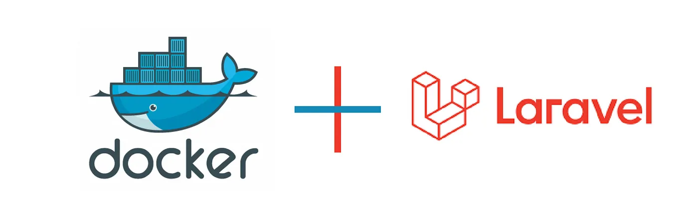

<h1 align="center">
 Laravel 12.x Rest API Starter Kit with Docker
</h1>

<p align="center"></p>

<h5 align="center">
A Laravel & Docker Development Setup
</h5>

## Features

- **Laravel 12** REST API starter, ready for develop and customization.
- **Dockerized environment**: PHP-FPM , Nginx, MySQL, phpMyAdmin, and Mailhog.
- **Easy setup** with Docker Compose.
- **Postman** API documentation link for quick reference.

## Services Overview (`docker-compose.yaml`)

| Service      | Description                                   | Ports         | Healthcheck      |
|--------------|-----------------------------------------------|---------------|------------------|
| **app**      | PHP-FPM container for Laravel                 | -             | Yes (depends on DB) |
| **nginx**    | Web server serving the application            | 80:80         | -                |
| **database** | MySQL 8.0 database                           | 3306:3306     | Yes              |
| **phpmyadmin** | Database management UI                    | 8888:80       | Yes (depends on DB) |
| **mailpit**  | Email testing tool (SMTP + web UI)           | 1025:1025, 8025:8025 | Yes          |

---

## Quick Start

### 1. Clone the Repository

```sh
git clone git@github.com:supravatm/laravel-v12-api-starter.git
cd laravel-v12-api-starter
```

### 2. Install Dependencies

```sh
docker run --rm -v "$(pwd)":/app composer install
```

### 3. Configure Environment Variables

Update your `.env` file for database credential:

```env
DB_CONNECTION=mysql
DB_HOST=database
DB_PORT=3306
DB_DATABASE=database
DB_USERNAME=user
DB_PASSWORD=password
```

### 4. Start Containers

```sh
docker-compose up -d
```

> **Note:** Some containers wait for the database service to be healthy before starting.

### 5. Laravel Setup

Run the following initialization commands:

```sh
docker-compose exec app php artisan key:generate
docker-compose exec app php artisan optimize
docker-compose exec app php artisan session:table
docker-compose exec app php artisan migrate
docker-compose exec app php artisan cache:clear
```

## Accessing Services

- **App (Nginx):** [http://localhost](http://localhost)
- **phpMyAdmin:** [http://localhost:8888](http://localhost:8888)
  - Use DB credentials from your `.env` file.
- **Mailpit UI:** [http://localhost:8025](http://localhost:8025)
  - SMTP: `localhost:1025` (for development email delivery)

---

## Email Testing

Mailpit is use for email testing. It stores messages and provides a web interface to view sent emails.  
No extra configuration needed for Laravel; just set the following in your `.env`:

```env
MAIL_MAILER=smtp
MAIL_HOST=mailpit
MAIL_PORT=1025
MAIL_USERNAME=null
MAIL_PASSWORD=null
MAIL_ENCRYPTION=null
```

---

## API Testing

<p align="center">
    

</p>
</br>
<p style="font-weight: bold;">
Complete REST API Documentation can be found <a href="https://documenter.getpostman.com/view/497605/2sB3BLjnwZ" target="_blank" rel="noopener noreferrer">here</a>
</p>

## Troubleshooting

- Ensure Docker Desktop (or Docker Engine) is running.
- If containers fail to start, use `docker-compose logs` for details.
- Database and phpMyAdmin may take a moment to become healthy.

---

## License

[MIT](https://opensource.org/licenses/MIT)